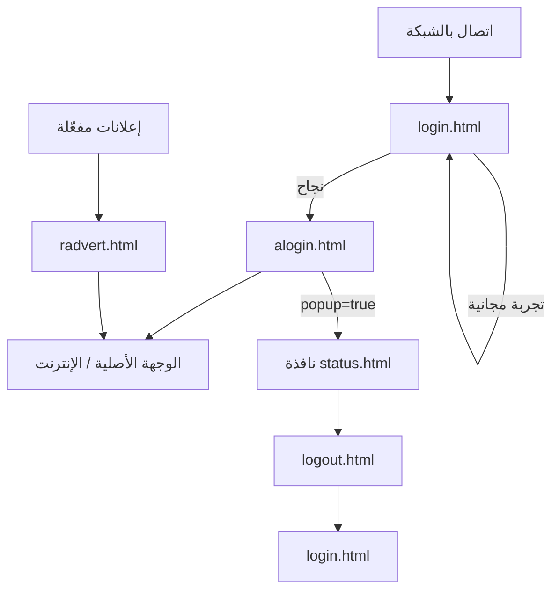

# تقرير فحص المشروع — MikroTik Hotspot Portal

**تاريخ الفحص:** 30 مايو 2026  
**المسار:** `d:\Moh\Fast\page\defult\hotspot`  
**النوع:** قوالب صفحات Hotspot لـ MikroTik RouterOS (واجهة ويب ثابتة)

---

## 1. ملخص تنفيذي

المشروع عبارة عن **حزمة صفحات Hotspot الافتراضية** من MikroTik لخدمة الإنترنت المقيد (Captive Portal). تُرفع الملفات إلى الراوتر وتُعرض للمستخدم عند محاولة الاتصال بالشبكة قبل منحه الوصول للإنترنت.

| البند | القيمة |
|--------|--------|
| عدد الملفات | 21 ملفاً |
| لغات البرمجة | HTML، CSS، JavaScript |
| خادم التشغيل | MikroTik RouterOS (Hotspot) |
| إطار عمل | لا يوجد — قوالب ثابتة مع متغيرات `$(...)` |
| قاعدة بيانات | لا |
| Git / package manager | غير موجود في المجلد |

---

## 2. الغرض والسياق

عند اتصال جهاز بشبكة Wi‑Fi محمية بـ Hotspot:

1. يُعاد توجيه المتصفح إلى `login.html`.
2. يُدخل المستخدم اسم المستخدم وكلمة المرور.
3. بعد النجاح: `alogin.html` ثم إعادة التوجيه للوجهة المطلوبة.
4. يمكن فتح نافذة `status.html` لمتابعة الجلسة.
5. عند الخروج: `logout.html`.

القوالب **لا تعمل كموقع مستقل** على Apache/Nginx؛ RouterOS يستبدل المتغيرات مثل `$(username)` و`$(link-login)` عند تقديم الصفحة.

---

## 3. هيكل المجلدات والملفات

```
hotspot/
├── login.html          # صفحة تسجيل الدخول الرئيسية
├── alogin.html         # بعد نجاح الدخول (إعادة توجيه + نافذة الحالة)
├── logout.html         # بعد تسجيل الخروج
├── status.html         # حالة الجلسة (IP، بيانات، وقت)
├── error.html          # أخطاء عامة للـ Hotspot
├── redirect.html       # إعادة توجيه بسيطة
├── rlogin.html         # تسجيل دخول لعملاء WISP/XML
├── radvert.html        # صفحة إعلان (عند تفعيل الإعلانات)
├── md5.js              # تشفير CHAP-MD5 لكلمة المرور
├── api.json            # واجهة JSON للتطبيقات (Captive Network Assistant)
├── errors.txt          # رسائل الأخطاء القابلة للتخصيص
├── css/
│   └── style.css       # التنسيق الموحد لجميع الصفحات
├── img/
│   ├── user.svg        # أيقونة اسم المستخدم
│   └── password.svg    # أيقونة كلمة المرور
└── xml/                # استجابات بروتوكول WISP (عملاء متقدمون)
    ├── login.html
    ├── alogin.html
    ├── logout.html
    ├── flogout.html
    ├── error.html
    ├── rlogin.html
    └── WISPAccessGatewayParam.xsd
```

---

## 4. تدفق المستخدم (User Flow)



### 4.1 `login.html`

- نموذج POST إلى `$(link-login-only)`.
- حقول: `username`, `password`, `dst`, `popup=true`.
- **CHAP:** إن وُجد `$(chap-id)` يُخفى النموذج الحقيقي ويُرسل MD5 عبر `doLogin()` و`md5.js`.
- **تجربة مجانية:** رابط `username=T-$(mac-esc)` عند `$(trial == 'yes')`.
- شعار MikroTik مدمج كـ SVG.
- تذييل: "Powered by MikroTik RouterOS".

### 4.2 `alogin.html`

- إعادة توجيه بعد ثانيتين إلى `$(link-redirect)`.
- إن `popup=true`: فتح `status.html` في نافذة صغيرة (`290×200`).

### 4.3 `status.html`

- عرض: IP، رفع/تنزيل، وقت الاتصال/المتبقي.
- إعلان معلّق: رابط "Advertisement required".
- تحديث تلقائي عبر `meta refresh` إن وُجد `$(refresh-timeout)`.
- زر Log out (ما لم يكن الدخول بـ MAC فقط).

### 4.4 `logout.html`

- ملخص الجلسة: username, IP, MAC, uptime, bytes.
- زر العودة لتسجيل الدخول.

### 4.5 `error.html` و `errors.txt`

- `error.html`: يعرض `$(error)` مع رابط لصفحة الدخول.
- `errors.txt`: يعرّف رسائل مثل `invalid-username`, `chap-missing`, `radius-timeout` — يمكن ترجمتها أو تخصيصها على الراوتر.

### 4.6 `api.json`

للتكامل مع **Captive Portal Assist** (مثلاً iOS/Android):

```json
{
   "captive": true/false,
   "user-portal-url": "...",
   "seconds-remaining": ...,
   "bytes-remaining": ...,
   "can-extend-session": true
}
```

القيم تُولَّد ديناميكياً من RouterOS.

---

## 5. المتغيرات الشائعة (MikroTik Template)

| المتغير | الاستخدام |
|---------|-----------|
| `$(link-login-only)` | رابط معالجة تسجيل الدخول |
| `$(link-orig)` / `$(link-redirect)` | الوجهة بعد الدخول |
| `$(username)` | اسم المستخدم (معبأ أو معروض) |
| `$(error)` | رسالة الخطأ |
| `$(chap-id)` / `$(chap-challenge)` | تحدي CHAP |
| `$(mac-esc)` | MAC للتجربة المجانية |
| `$(ip)`, `$(uptime)`, `$(bytes-in-nice)` | في status/logout |
| `$(if ...)` / `$(endif)` | شروط القالب |

قائمة كاملة: [MikroTik Hotspot Customization](https://help.mikrotik.com/docs/display/ROS/Hotspot+Customisation).

---

## 6. الأمان والمصادقة

| الآلية | التفاصيل |
|--------|----------|
| **CHAP-MD5** | `hexMD5(chap-id + password + chap-challenge)` قبل الإرسال — كلمة المرور لا تُرسل نصاً صريحاً عند تفعيل CHAP |
| **PAP** | إرسال مباشر لـ username/password عند عدم CHAP |
| **Cache** | `no-cache`, `expires=-1` على معظم الصفحات |
| **WISP/XML** | مجلد `xml/` لعملاء يدعمون WISP Access Gateway |

**ملاحظات:**

- `md5.js` يُحمَّل من `/md5.js` (جذر الموقع على الراوتر) وليس `md5.js` النسبي — يجب أن يكون الملف في جذر html-directory على RouterOS.
- لا يوجد HTTPS في القوالب نفسها؛ يعتمد على إعداد Hotspot على الجهاز.

---

## 7. التصميم والواجهة (`css/style.css`)

### 7.1 المظهر الافتراضي

- خلفية متدرجة (ألوان رمادية/زرقاء/بيج).
- نموذج مركزي بعرض `410px` على الشاشات ≥576px، و`100%` على الجوال.
- حقول إدخال شفافة مع أيقونات SVG.
- زر Connect: `#3e4d59`.
- رسائل الخطأ: `.info.alert` بلون `#da3d41`.

### 7.2 ثيمات بديلة (في HTML كتعليق)

```html
<body class="lite">   <!-- خلفية بيضاء -->
<body class="dark">   <!-- خلفية داكنة، أزرار حمراء -->
```

### 7.3 مشكلة CSS مكتشفة

في قاعدة `input[type=text]` و`input[type=password]` يوجد خطأ في السطر المضغوط:

```css
border:1px solid background-color: rgba(255,255,255,.8);
```

المفترض فصل `border` عن `background-color`. المتصفحات قد تتجاهل جزءاً من القاعدة؛ يُفضّل إصلاحه عند التخصيص.

---

## 8. مجلد `xml/` — بروتوكول WISP

للعملاء الذين يطلبون `target=xml`:

| الملف | MessageType | ResponseCode | المعنى |
|-------|-------------|--------------|--------|
| `rlogin.html` | 100 | 0 | Redirect للدخول |
| `login.html` | 120 | 100/102 | فشل مصادقة |
| `alogin.html` | 120 | 50 | نجاح + LogoffURL + RedirectionURL |
| `logout.html` / `flogout.html` | 130 | 150 | تسجيل خروج |
| `error.html` | 120 | 255 | خطأ |

`WISPAccessGatewayParam.xsd`: مخطط XML للتحقق من البنية.

---

## 9. JavaScript

| الملف | الوظيفة |
|-------|---------|
| `md5.js` | تنفيذ RFC 1321 MD5 (Paul Johnston) — `hexMD5()` للـ CHAP |
| `login.html` | `doLogin()` — نسخ credentials للنموذج المخفي |
| `status.html` | `openLogout()`, `openAdvert()` |
| `logout.html` | `openLogin()` — إغلاق نافذة popup |
| `alogin.html` | `startClock()` — redirect + popup status |
| `radvert.html` | إدارة نوافذ الإعلان |

---

## 10. نقاط التخصيص الموصى بها

1. **الهوية:** استبدال SVG الشعار في `login.html` بشعار الشبكة/الشركة.
2. **اللغة:** ترجمة النصوص في HTML و`errors.txt` (عربي، إلخ).
3. **`errors.txt`:** رسائل أوضح للمستخدم النهائي.
4. **الألوان:** تعديل `style.css` أو استخدام `lite` / `dark`.
5. **إزالة:** "Powered by MikroTik RouterOS" إن رُغب (الترخيص: تحقق من شروط MikroTik).
6. **مسار md5:** توحيد `<script src="md5.js">` أو التأكد من رفع الملف في html-directory الصحيح على الراوتر.
7. **User Manager:** تعليق في `status.html` لربط `http://$(hostname)/user?subs=`.

---

## 11. النشر على MikroTik

1. رفع مجلد `hotspot` بالكامل إلى الراوتر:
   - Winbox: **Files** → مجلد hotspot html
   - أو FTP إلى المسار المُعرَّف في `/ip hotspot profile`
2. في **Hotspot Server Profile** → **HTML Directory**: اختيار هذا المجلد.
3. التأكد من تفعيل **login by** المناسب (http-chap / http-pap / trial).
4. اختبار CHAP: JavaScript مفعّل في المتصفح.

---

## 12. الاعتماديات والتراخيص

| المكوّن | المصدر |
|---------|--------|
| قوالب HTML | MikroTik RouterOS (افتراضي) |
| md5.js | Paul Johnston — راجع pajhome.org.uk |
| أيقونات user/password | Font Awesome style SVG |

---

## 13. ما لا يتضمنه المشروع

- لا يوجد backend (PHP/Node).
- لا يوجد build أو bundler.
- لا توجد اختبارات آلية.
- لا README أصلي في المجلد (هذا الملف يكمّله).
- لا تكامل دفع أو إدارة مستخدمين من الواجهة (يُدار من RouterOS / User Manager).

---

## 14. توصيات سريعة

| الأولوية | الإجراء |
|----------|---------|
| عالية | إصلاح خطأ CSS في `border` / `background-color` |
| عالية | التحقق من مسار `/md5.js` عند استخدام CHAP |
| متوسطة | تعريب `login.html`, `status.html`, `errors.txt` |
| متوسطة | استبدال شعار MikroTik بشعار العلامة |
| منخفضة | إضافة `lang="ar"` و`dir="rtl"` للواجهة العربية |
| منخفضة | تهيئة Git لتتبع التخصيصات |

---

## 15. خريطة الصفحات ↔ الملفات

| السيناريو | الملف |
|-----------|--------|
| أول زيارة / captive | `login.html` |
| نجاح الدخول | `alogin.html` → redirect |
| متابعة الجلسة | `status.html` |
| خروج | `logout.html` |
| خطأ نظام | `error.html` |
| عميل WISP | `xml/*.html`, `rlogin.html` |
| إعلان إجباري | `radvert.html` |
| API جهاز محمول | `api.json` |

---

*تم إنشاء هذا التقرير آلياً بفحص شامل لجميع ملفات المشروع.*
